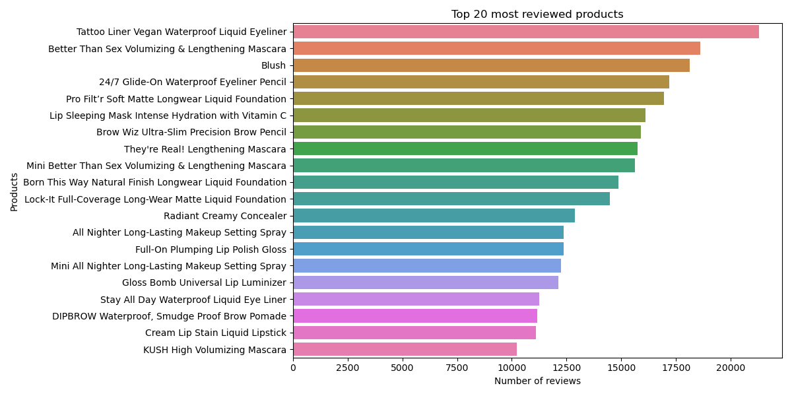
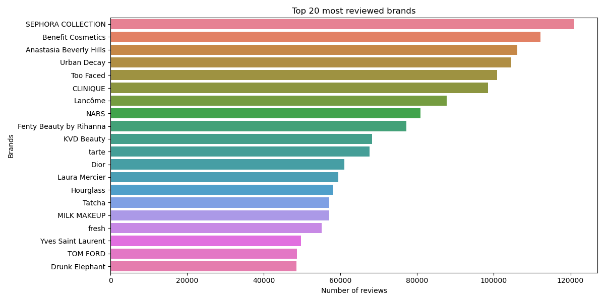
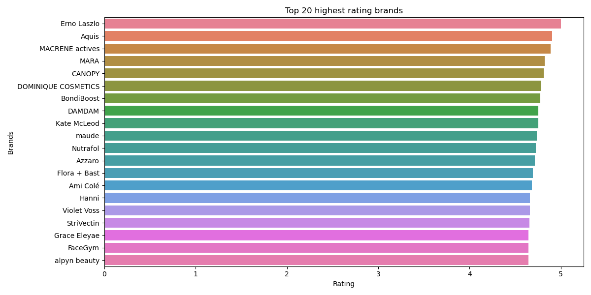
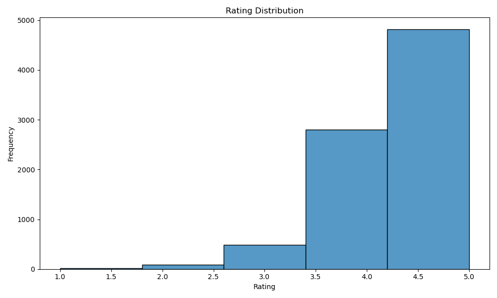
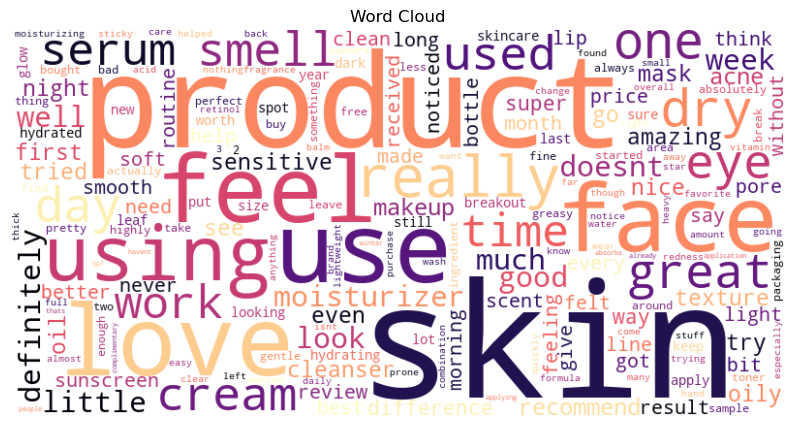
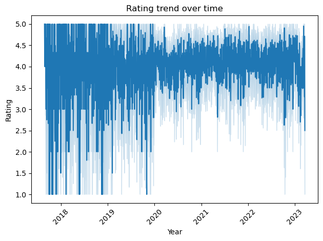
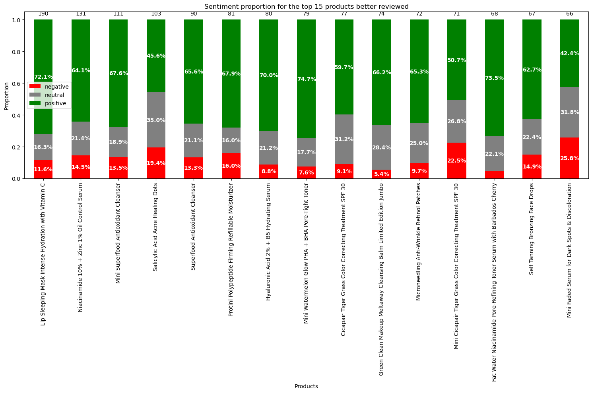

# Product Review Analysis of Sephora Using NLP and Visualizations

This project aims to analyze thousands of beauty product reviews from Sephora, answering key questions about popularity, customer perception, most discussed topics, and user sentiment. Using NLP techniques and exploratory analysis, we seek insights that can support the company in marketing strategies and product development.

---

## Business Questions

- Which products have the most reviews?
- Which products and brands are the highest rated?
- What is the overall sentiment of reviews by product type?
- What are the main topics mentioned in the reviews?
- Which topics show the most positive or negative sentiments?

---

## Data

The project uses two datasets:

- `df_info`: Product information (name, brand, rating, number of reviews, etc.)
- `dfs_reviews`: A list with five DataFrames containing textual reviews and metadata (rating, recommendation, date, etc.)

### Preprocessing

- Removal of irrelevant columns (`Unnamed: 0`)
- Elimination of null values in critical columns (rating, reviews, review_text, etc.)
- Tokenization, cleaning, and normalization of text

---

## Exploratory Data Analysis (EDA)

### Most Popular and Highest-Rated Products

💡 The most popular products are not necessarily the highest-rated ones, suggesting that niche items may have better acceptance, while popular products tend to have diluted averages.

---

### Most Popular vs. Highest-Rated Brands

💡 The pattern repeats for brands — the most reviewed are not the best rated. Niche brands with loyal audiences stand out positively.

---

### Rating Distribution

💡 The distribution is right-skewed. Most reviews have high ratings, highlighting overall customer satisfaction.

---

### Word Cloud

💡 Terms related to skincare, such as “skin,” “cream,” “moisturizer,” “love,” and “great,” are predominant. This reinforces the success of the skincare line and the positive sentiment.

---

### Temporal Analysis

💡 The chart shows a trend toward more positive and less dispersed reviews starting in 2020, suggesting a possible improvement in product quality or a change in consumer behavior over time.

---

## Natural Language Processing (NLP)

### Sentiment

💡 Among the 15 most-reviewed products, most reviews are positive, with proportions above 50%. Only two products show a more mixed sentiment, but still with the majority being positive (over 40%).

---

### Topics with BERTopic

- **50 unique topics** were extracted using BERTopic to reduce redundancy.

### Most Discussed Topics

💡 Skincare-related topics dominate — moisturizers, sunscreens, serums, etc.

### Most Positive Topics

💡 The most popular topics are also closely related to skincare. Additionally, issues like oily skin, dark circles, and chapped lips appear to be well addressed by the products.

### Most Negative Topics

💡 It is not possible to gather 10 topics where negative sentiment is predominant. Thus, the main complaints revolve around:

- Packaging that doesn't work properly  
- Changes in formulas that customers disliked  
- Products that caused a burning sensation on sensitive skin  

---

## Insights and Recommended Actions

### For the Marketing Team:

- Leverage campaigns around the highest-rated products and topics, especially **skincare**
- Promote well-rated niche products

### For the Product/Partner Team:

- Investigate products that had formula changes and consider reverting to the previous formula  
- Review packaging for products reported to have quick defects  
- **Report to brands** any issues related to formulas or allergic reactions

---

## Conclusion

Sephora demonstrates excellent product curation, with very high levels of customer satisfaction. The dominance of skincare products in the reviews highlights an opportunity to strengthen this segment. Sentiment and topic analysis proved to be an effective tool for understanding customer pain points and desires at scale.
